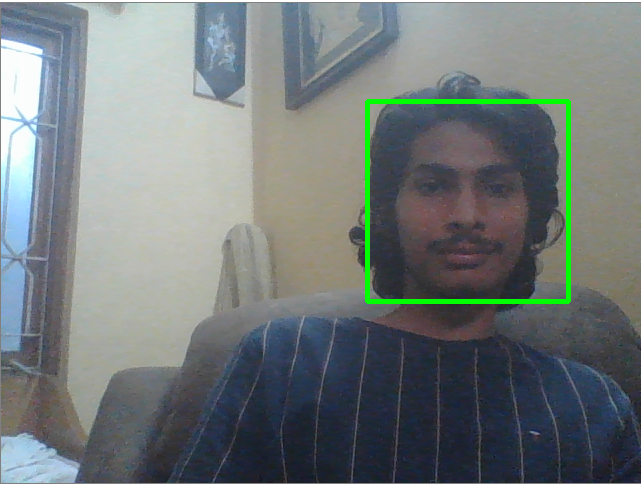
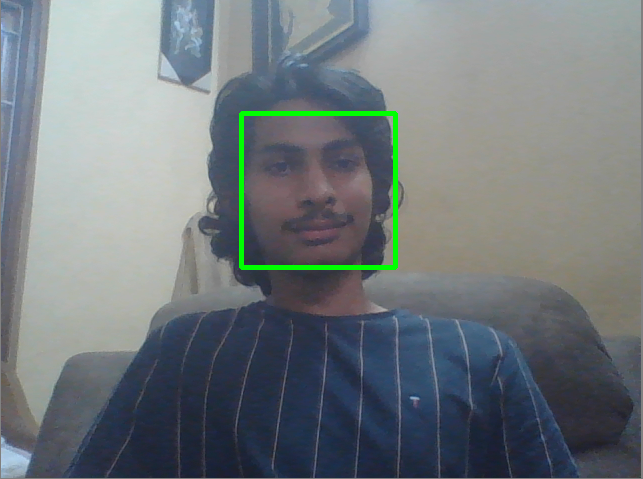
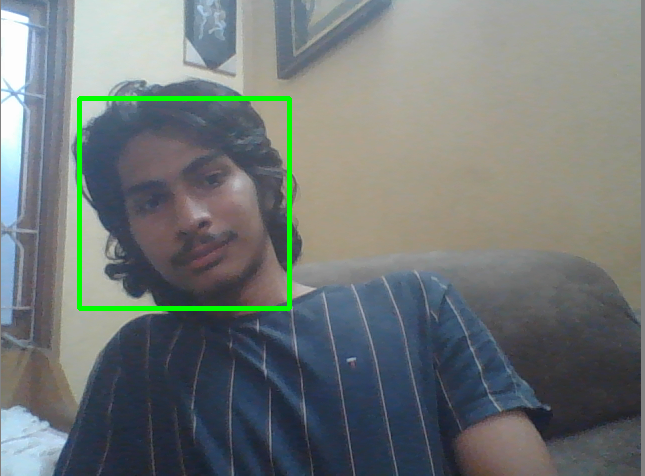

# dancing-piano
*A computer vision application that produces a virtual piano around your head. Moving your head towards the right produces a higher pitched note while moving it to the left produces a lower pitched note.*

### Table of Contents

### Functionality 
This application uses the Python OpenCV libraries - DLIB and CV2 to perform face tracking in real-time. Using the edge coordinates of the face, a note is associated on the virtual piano. This note is played using the pygame module. Threading is performed to maximize the potential of the application. 

### Requirements
* Python 
* OpenCV (cv2)
* dlib
* pygame 

### Set-up
* OpenCV installation 
- This might be a bit of a hassle but here is a good walkthrough or the same (https://towardsdatascience.com/install-and-configure-opencv-4-2-0-in-windows-10-python-7a7386ae024)  

* Dlib installation is included the above walkthrough 
* To install rest of these packages you can use `pip install [package_name]`
* You can start the application using `python ComputerVision.py` (The face tracking will start - you can rename this file to main.py and then run it too)

### Usage 
* After running the python script using `python ComputerVision.py`, the application automatically starts
* If the face recognition is unable to track back your face - hit the button '1' on your keyboard. This allows the application to retrack your face. 
* You can use the 'Esc' button to exit the application  

### Pictures 
<li>

Right (High Pitched Note)

<li/>

<li>

Center (Medium Pitched Note)

<li/>

<li>

Left (Low Pitched Note)

<li/>

## Sources
* 1) OpenCV installation in Python - https://towardsdatascience.com/install-and-configure-opencv-4-2-0-in-windows-10-python-7a7386ae024
